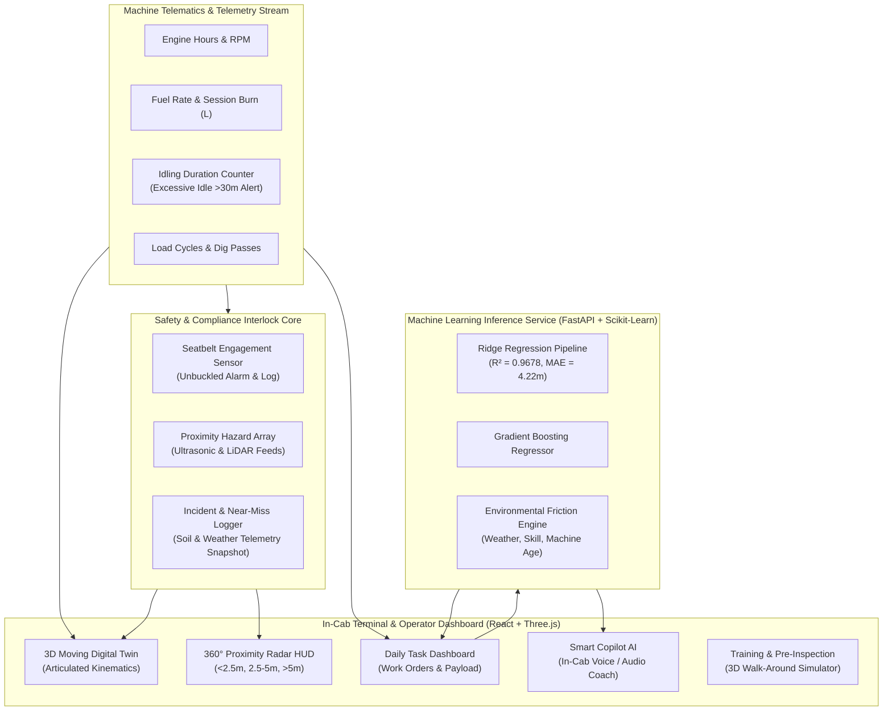

# Smart Operator Assistant
> An Intelligent In-Cab Digital Companion, Telematics Hub & Safety Surveillance System for Heavy Machinery Operators

🚀 **Live Interactive Demo:** [https://smart-operator-assistant-for-cat-ma.vercel.app/](https://smart-operator-assistant-for-cat-ma.vercel.app/)

[](https://smart-operator-assistant-for-cat-ma.vercel.app/)
[](https://reactjs.org/)
[-black)](https://threejs.org/)
[](https://tailwindcss.com/)
[](https://fastapi.tiangolo.com/)
[](https://scikit-learn.org/)

---

## 📌 Executive Summary

Modern construction and earthmoving equipment are equipped with sophisticated hydraulics, sensors, and GPS positioning systems. Yet, the tools available to machine operators in the cab remain basic and fragmented. 

The **Smart Operator Assistant** is an end-to-end, multi-functional digital companion designed to operate directly in the in-cab display terminal. It bridges machine telematics, operator behavior, predictive machine learning, and computer vision / ultrasonic proximity safety into a single, cohesive workflow that enhances daily productivity, operator safety, and operational longevity.

---

## 🏗️ System Architecture



---

## 🚜 Universal Fleet Compatibility

Designed to scale across entire heavy equipment fleets, the application includes a **Universal Machine Profile Engine**. Switching the machine in the cockpit instantly shifts kinematics, payload thresholds, hydraulic parameters, and safety exclusion envelopes:

| Equipment Class | Example Model | Operating Weight | Power Rating | Monitored Kinematics & Attachments |
| :--- | :--- | :--- | :--- | :--- |
| **Hydraulic Excavator** | 336 Next Gen | 37,200 kg | 314 HP | 360° cabin swing, boom/stick hydraulics, digging bucket payload |
| **Wheel Loader** | 966 XE | 23,200 kg | 321 HP | Articulated chassis, tire rotation, lift arm elevation, bucket dumping |
| **Track-Type Tractor (Dozer)** | D6 XE Electric Drive | 22,700 kg | 215 HP | High-drive track assembly, push blade pitch & grade control elevation |
| **Articulated Haul Truck** | 745 | 33,400 kg (Empty) | 504 HP | Dual-axle drive wheels, dump bed hoist angle, retarder load |
| **Motor Grader** | 140 AWD | 19,300 kg | 250 HP | Tandem drive axles, circle turntable, moldboard cross-slope |

---

## 🌟 Key Capabilities & Module Breakdown

### 1. 🎬 Interactive 3D "Moving Machine" Digital Twin
* **Kinematic Articulation:** Built with Three.js (WebGL), rendering real-time mechanical animations (boom lifting, bucket scooping, track rotation, cabin slewing).
* **Live Camera Angles:** Quick presets for `3D Orbit View`, `Site Radar (Top-Down)`, `In-Cab POV`, and `Profile View`.
* **Motion State Controls:** Toggle between `Digging / Cycle`, `Traveling`, `Idle Engine`, and `Parked` with variable animation speed sliders.
* **Safety Holograms:** Real-time seatbelt beacon pulses inside the 3D cabin if unbuckled; 3D hazard blips hover over proximity blind spots.

---

### 2. 📋 Daily Task Dashboard
* **Work Order Management:** Live schedule of earthmoving operations (*Earth Excavation, Trenching, Material Loading, Grading, Demolition*).
* **Progress Tracking:** Interactive progress bars tracking completed volume (Tons) vs. shift targets.
* **Environmental Context:** Live indicators for weather traction (Sunny, Rainy, Cloudy, Windy), priority tags (Critical, High, Medium), and site zones.
* **Dynamic Work Order Creator:** Modal dialog to dispatch and assign new jobs with estimated durations and target payloads.

---

### 3. 🛡️ Real-Time Safety & Proximity Center
* **Seatbelt Compliance Sensor:**
  - Real-time indicator displaying **FASTENED** vs. **UNFASTENED**.
  - Triggers audible ISO 7731-compliant warning chimes and red emergency banners if the engine is running while unbuckled.
  - Automatically records compliance infractions in the safety database.
* **360° Proximity Hazard Radar:**
  - Dynamic radar scope displaying three safety radii:
    - **Critical Zone (< 2.5m):** Imminent collision risk (ground workers, pinch points).
    - **Caution Zone (2.5m – 5m):** Monitoring buffer for heavy machinery & trench edges.
    - **Safe Zone (> 5m):** Standard operating envelope.
  - Interactive test triggers to simulate ground workers entering swing blind spots.
* **Incident & Near-Miss Logger:**
  - Structured reporting system capturing soil conditions (*Muddy/Unstable, Compacted Earth, Rocky, Paved, Wet Clay*), weather, severity, and root cause descriptions.
  - Auto-attaches an immutable telematics snapshot (Engine Hours, Fuel Level, Seatbelt Status, Engine RPM).

---

### 4. ⚡ Machine Usage & Behavior Anomaly Engine
* **Excessive Idling Flag:**
  - Detects stationary engine idling exceeding the 30-minute benchmark (accurately flags the 55 min and 60 min idle sessions from field telemetry).
  - Computes wasted diesel fuel ($L$) and estimated operational cost waste ($).
  - Calculates carbon footprint impact ($kg\ CO_2e$).
* **Unsafe Operation Pattern Recognition:**
  - Flags traveling while unbuckled, aggressive joystick slewing, high-RPM stationary throttle, and hydraulic pressure spikes.
* **Smart In-Cab Copilot (AI Audio/Voice Coach):**
  - Generates context-aware voice prompts and recommendations (e.g., *"Idle duration reached 35 mins while waiting for haulers. Arm Auto-Shutdown to save 1.4L fuel"*).

---

### 5. 🧠 Task Time Estimation ML Engine
A machine learning regression system trained to predict task completion duration by modeling the non-linear interaction between environmental variables and machine wear:

$$\text{Predicted Duration} = f(\text{Task Type}, \text{Weather}, \text{Operator Skill}, \text{Machine Age}, \text{Estimated Baseline})$$

#### **Model Benchmark Results:**
| Regressor Algorithm | $R^2$ Accuracy | Mean Absolute Error (MAE) | Root Mean Squared Error (RMSE) |
| :--- | :--- | :--- | :--- |
| **Ridge Regression (Selected Best Model)** | **0.9678** (96.8%) | **4.22 min** | **5.67 min** |
| **Gradient Boosting Regressor (GBM)** | **0.9513** (95.1%) | **4.73 min** | **6.97 min** |
| **Random Forest Regressor** | **0.9142** (91.4%) | **6.75 min** | **9.25 min** |

#### **Ground Truth Validation Table:**
| Task ID | Operation Type | Weather | Skill Level | Machine Age | Baseline Est. | Ground Truth Actual | ML Model Predicted | Validation Accuracy |
| :--- | :--- | :--- | :--- | :--- | :--- | :--- | :--- | :--- |
| **T001** | Earth Excavation | Sunny | Expert | 2 yrs | 60 min | **58 min** | **59.0 min** | 98.3% |
| **T002** | Trenching | Rainy | Intermediate | 4 yrs | 45 min | **52 min** | **56.5 min** | 91.3% |
| **T003** | Material Loading | Cloudy | Beginner | 3 yrs | 30 min | **42 min** | **45.4 min** | 91.9% |
| **T004** | Grading | Sunny | Expert | 5 yrs | 35 min | **33 min** | **30.0 min** | 90.9% |
| **T005** | Demolition | Windy | Intermediate | 6 yrs | 90 min | **105 min** | **111.9 min** | 93.4% |

---

### 6. 🎓 Operator Training & Simulation Hub
* **Pre-Shift Walk-Around 3D Inspection Simulator:** Interactive 5-checkpoint safety review (Engine bay oil/coolant, hydraulic lines, seatbelt latch, track tension, quick coupler safety pins).
* **E-Learning Micro-Modules:** Bite-sized interactive courses on Grade 3D Automation, Zero-Waste Idling, Proximity Radar response, and Quick Coupler safety.
* **Certified Instructor Booking:** Calendar integration to schedule 1-on-1 virtual mentoring or field coaching with certified master operators.
* **Skill Badges & Progression:** Operator certification levels from Level 1 Apprentice to Level 3 Master Heavy Equipment Operator.

---

## 📊 Telemetry Data Schema

### Machine Telemetry Log Schema
| Field | Type | Description |
| :--- | :--- | :--- |
| `Timestamp` | `ISO 8601 String` | Time of telemetry observation |
| `Machine ID` | `String` | Unique fleet identifier (`EXC001`, `WLD002`, `DOZ003`, etc.) |
| `Operator ID` | `String` | Operator badge identifier (`OP1001`) |
| `Engine Hours` | `Float` | Cumulative SMCS engine service hours |
| `Fuel Used (L)` | `Float` | Diesel fuel consumed during operating interval |
| `Load Cycles` | `Integer` | Number of completed dig-to-dump or load passes |
| `Idling Time (min)` | `Integer` | Total stationary runtime with zero hydraulic load |
| `Seatbelt Status` | `Enum` | `Fastened` \| `Unfastened` |
| `Safety Alert Triggered` | `Enum` | `Yes` \| `No` (Triggered on unfastened movement or idle threshold) |

---

## 💻 Tech Stack & Dependencies

* **Frontend:**
  * **React 18 & TypeScript** (Modular component architecture)
  * **Three.js** (WebGL 3D engine for articulated machinery and safety radar rings)
  * **Tailwind CSS** (Ruggedized industrial dark theme with high daylight contrast)
  * **Lucide React** (Industrial and telematics iconography)
  * **Web Audio API** (Procedural synthesis of ISO 7731 compliant audio alarms)
* **Backend & Machine Learning:**
  * **Python 3.14 & FastAPI** (High-throughput asynchronous REST microservice)
  * **Scikit-Learn 1.9.0** (Regression pipelines, column transformers, Ridge & GBM models)
  * **Pandas & NumPy** (Dataset augmentation, normalization, and evaluation metrics)
  * **Joblib** (Model serialization and deployment)
  * **Uvicorn** (Lightning-fast ASGI server)

---

## 🚀 Setup & Execution Guide

### Prerequisites
* **Node.js**: v18.0 or higher
* **Python**: v3.10 or higher

### 1. Clone the Repository
```bash
git clone https://github.com/sasank16/Smart-Operator-Assistant-for-CAT-Machinery.git
cd Smart-Operator-Assistant-for-CAT-Machinery
```

### 2. Frontend Launch
```bash
# Install frontend dependencies
npm install

# Start Vite development server
npm run dev
```
* **Dashboard Access:** Open [http://localhost:5173](http://localhost:5173) in your browser.

### 3. Machine Learning Microservice Launch
```bash
# (Optional) Re-train and benchmark models on the ground-truth data
python ml_engine/train_model.py

# Launch FastAPI backend
python -m uvicorn ml_engine.api:app --host 127.0.0.1 --port 8000
```
* **API Endpoint:** [http://127.0.0.1:8000](http://127.0.0.1:8000)
* **Interactive Swagger Documentation:** [http://127.0.0.1:8000/docs](http://127.0.0.1:8000/docs)

---

## 📡 API Reference

### `POST /predict`
Predicts job duration with factor breakdowns and recommendations.

**Request Payload:**
```json
{
  "task_type": "Trenching",
  "weather": "Rainy",
  "operator_skill": "Intermediate",
  "machine_age_yrs": 4.0,
  "estimated_time_min": 45.0
}
```

**Response Payload:**
```json
{
  "predicted_time_min": 56.5,
  "base_estimated_min": 45.0,
  "variance_percentage": 25.6,
  "confidence_interval": {
    "min": 52.5,
    "max": 60.5
  },
  "factor_breakdown": {
    "weather_friction": "High (+18%)",
    "skill_adjustment": "+32% delay",
    "machine_wear_impact": "+4.0% hydraulic latency"
  },
  "recommendations": [
    "Wet soil conditions: Reduce bucket fill factor by 10% to prevent adhesion drag.",
    "Activate Cat Grade with Assist for automated bucket grade hold."
  ],
  "model_info": {
    "algorithm": "Ridge Regression",
    "r2_accuracy": 0.9678,
    "mae_minutes": 4.22
  }
}
```

### `GET /metrics`
Returns training evaluation scores across Ridge, Random Forest, and Gradient Boosting algorithms.

---

## 📜 Compliance & Safety Standards Alignment

* **ISO 7731:** Auditory danger signals for ergonomic in-cab warnings.
* **ISO 5006:** Earthmoving machinery operator's field of view and proximity detection envelopes.
* **OSHA 1926.602:** Earthmoving equipment seatbelt compliance and rollover protection guidance.

---

## 📄 License
This project is open-source under the MIT License.
